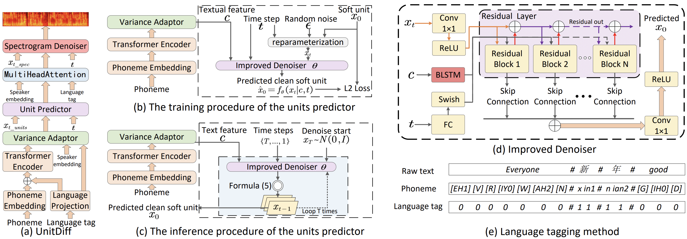

{:.no_toc}
* toc
{:toc}

# Abstract
Given the scarcity of Code-Switching (CS) datasets, most researchers synthesize CS speech using multiple monolingual datasets. However, this method poses challenges in synthesizing natural CS speech. One challenge is the consistency between the speaker's language and the text's language, making controlling the speaker's identity difficult. Another challenge is the mismatch between training and testing, causing low intelligibility of the generated speech. In this paper, we propose UnitDiff, a CS speech synthesis model based on the unit-diffusion framework. The model employs the self-supervised high-level representation 'soft unit' extracted from soft HuBERT to directly predict a clean mel-spectrogram $x_0$. This approach enhances control over speaker identity. We also introduce a language tagging method to improve speech intelligibility. Evaluation results validate the model's effectiveness in improving the intelligibility, speaker similarity, and speaker consistency of the generated CS speech.

## Intra-lingual synthesis comparison
#### Chinese
<ruby>Text: 最终，中国男子乒乓球队获得此奖项。</ruby>
<table>
	<thead>
		<tr>
	<th style="text-align: center">YourTTS</th>
            <th style="text-align: center">PPG-model</th>
            <th style="text-align: center">UnitDiff</th>
		</tr>
	</thead>
	<tbody>
		<tr>
			<td style="text-align: center"><audio controls style="width: 150px;"><source src="zh/MOS/CN/IN/MOS_IN_CN_yourtts_text_02.wav" type="audio/wav"></audio></td>
            <td style="text-align: center"><audio controls style="width: 150px;"><source src="zh/MOS/CN/IN/MOS_IN_CN_ppg_model_02.wav" type="audio/wav"></audio></td>
            <td style="text-align: center"><audio controls style="width: 150px;"><source src="zh/MOS/CN/IN/MOS_IN_CN_unitdiff_02.wav" type="audio/wav"></audio></td>
		</tr>
	</tbody>
</table>

<ruby>Text: 恭祝大家新春愉快！身体健康！万事顺遂！阖家幸福！</ruby>
<table>
	<thead>
		<tr>
	<th style="text-align: center">YourTTS</th>
            <th style="text-align: center">PPG-model</th>
            <th style="text-align: center">UnitDiff</th>
		</tr>
	</thead>
	<tbody>
		<tr>
			<td style="text-align: center"><audio controls style="width: 150px;"><source src="zh/MOS/CN/IN/MOS_IN_CN_yourtts_text_03.wav" type="audio/wav"></audio></td>
            <td style="text-align: center"><audio controls style="width: 150px;"><source src="zh/MOS/CN/IN/MOS_IN_CN_ppg_model_03.wav" type="audio/wav"></audio></td>
            <td style="text-align: center"><audio controls style="width: 150px;"><source src="zh/MOS/CN/IN/MOS_IN_CN_unitdiff_03.wav" type="audio/wav"></audio></td>
		</tr>
	</tbody>
</table>

#### English
<ruby>Text: Thus, the local chief of police could be given a master plan, prepared for the occasion, of all protective measures to be taken during the visit;</ruby>
<table>
	<thead>
		<tr>
	<th style="text-align: center">YourTTS</th>
            <th style="text-align: center">PPG-model</th>
            <th style="text-align: center">UnitDiff</th>
		</tr>
	</thead>
	<tbody>
		<tr>
			<td style="text-align: center"><audio controls style="width: 150px;"><source src="zh/MOS/EN/IN/MOS_IN_EN_yourtts_text_01.wav" type="audio/wav"></audio></td>
            <td style="text-align: center"><audio controls style="width: 150px;"><source src="zh/MOS/EN/IN/MOS_IN_EN_ppg_model_01.wav" type="audio/wav"></audio></td>
            <td style="text-align: center"><audio controls style="width: 150px;"><source src="zh/MOS/EN/IN/MOS_IN_EN_unitdiff_01.wav" type="audio/wav"></audio></td>

		</tr>
	</tbody>
</table>

<ruby>Text: between Secretary Dillon and Donald F. Hornig, Special Assistant to the President for Science and Technology, is a useful effort in the right direction.</ruby>
<table>
	<thead>
		<tr>
	<th style="text-align: center">YourTTS</th>
            <th style="text-align: center">PPG-model</th>
            <th style="text-align: center">UnitDiff</th>
		</tr>
	</thead>
	<tbody>
		<tr>
			<td style="text-align: center"><audio controls style="width: 150px;"><source src="zh/MOS/EN/IN/MOS_IN_EN_yourtts_text_02.wav" type="audio/wav"></audio></td>
            <td style="text-align: center"><audio controls style="width: 150px;"><source src="zh/MOS/EN/IN/MOS_IN_EN_ppg_model_02.wav" type="audio/wav"></audio></td>
            <td style="text-align: center"><audio controls style="width: 150px;"><source src="zh/MOS/EN/IN/MOS_IN_EN_unitdiff_02.wav" type="audio/wav"></audio></td>
		</tr>
	</tbody>
</table>

## Cross-lingual synthesis
#### Text: Chinese; Speaker: English female
<ruby>Text: 最终，中国男子乒乓球队获得此奖项。</ruby>
<table>
	<thead>
		<tr>
	<th style="text-align: center">YourTTS</th>
            <th style="text-align: center">PPG-model</th>
            <th style="text-align: center">UnitDiff</th>
		</tr>
	</thead>
	<tbody>
		<tr>
			<td style="text-align: center"><audio controls style="width: 150px;"><source src="zh/MOS/EN/cross/MOS_Cross_EN_yourtts_text_02.wav" type="audio/wav"></audio></td>
            <td style="text-align: center"><audio controls style="width: 150px;"><source src="zh/MOS/EN/cross/MOS_Cross_EN_ppg_model_02.wav" type="audio/wav"></audio></td>
            <td style="text-align: center"><audio controls style="width: 150px;"><source src="zh/MOS/EN/cross/MOS_Cross_EN_unitdiff_02.wav" type="audio/wav"></audio></td>
		</tr>
	</tbody>
</table>

<ruby>Text: 恭祝大家新春愉快！身体健康！万事顺遂！阖家幸福！</ruby>
<table>
	<thead>
		<tr>
	<th style="text-align: center">YourTTS</th>
            <th style="text-align: center">PPG-model</th>
            <th style="text-align: center">UnitDiff</th>
		</tr>
	</thead>
	<tbody>
		<tr>
			<td style="text-align: center"><audio controls style="width: 150px;"><source src="zh/MOS/EN/cross/MOS_Cross_EN_yourtts_text_03.wav" type="audio/wav"></audio></td>
            <td style="text-align: center"><audio controls style="width: 150px;"><source src="zh/MOS/EN/cross/MOS_Cross_EN_ppg_model_03.wav" type="audio/wav"></audio></td>
            <td style="text-align: center"><audio controls style="width: 150px;"><source src="zh/MOS/EN/cross/MOS_Cross_EN_unitdiff_03.wav" type="audio/wav"></audio></td>
		</tr>
	</tbody>
</table>

#### Text: English; Speaker: Mandarin female
<ruby>Text: Thus, the local chief of police could be given a master plan, prepared for the occasion, of all protective measures to be taken during the visit;</ruby>
<table>
	<thead>
		<tr>
	<th style="text-align: center">YourTTS</th>
            <th style="text-align: center">PPG-model</th>
            <th style="text-align: center">UnitDiff</th>
		</tr>
	</thead>
	<tbody>
		<tr>
			<td style="text-align: center"><audio controls style="width: 150px;"><source src="zh/MOS/CN/cross/MOS_Cross_CN_yourtts_text_01.wav" type="audio/wav"></audio></td>
            <td style="text-align: center"><audio controls style="width: 150px;"><source src="zh/MOS/CN/cross/MOS_Cross_CN_ppg_model_01.wav" type="audio/wav"></audio></td>
            <td style="text-align: center"><audio controls style="width: 150px;"><source src="zh/MOS/CN/cross/MOS_Cross_CN_unitdiff_01.wav" type="audio/wav"></audio></td>

		</tr>
	</tbody>
</table>

<ruby>Text: between Secretary Dillon and Donald F. Hornig, Special Assistant to the President for Science and Technology, is a useful effort in the right direction.</ruby>
<table>
	<thead>
		<tr>
	<th style="text-align: center">YourTTS</th>
            <th style="text-align: center">PPG-model</th>
            <th style="text-align: center">UnitDiff</th>
		</tr>
	</thead>
	<tbody>
		<tr>
			<td style="text-align: center"><audio controls style="width: 150px;"><source src="zh/MOS/CN/cross/MOS_Cross_CN_yourtts_text_02.wav" type="audio/wav"></audio></td>
            <td style="text-align: center"><audio controls style="width: 150px;"><source src="zh/MOS/CN/cross/MOS_Cross_CN_ppg_model_02.wav" type="audio/wav"></audio></td>
            <td style="text-align: center"><audio controls style="width: 150px;"><source src="zh/MOS/CN/cross/MOS_Cross_CN_unitdiff_02.wav" type="audio/wav"></audio></td>
		</tr>
	</tbody>
</table>

## Code-switching synthesis
#### Text: Chinese+English; Speaker: Mandarin female
<ruby>Text: 我今天在home超级happy. 你今天过得怎么样？Do you have any plan to go to 学校?</ruby>
<table>
	<thead>
		<tr>
                                               <th style="text-align: center">YourTTS</th>
            <th style="text-align: center">PPG-model</th>
            <th style="text-align: center">UnitDiff</th>
		</tr>
	</thead>
	<tbody>
		<tr>
			<td style="text-align: center"><audio controls style="width: 150px;"><source src="zh/MOS/CN/CS/MOS_CS_CN_yourtts_text_01.wav" type="audio/wav"></audio></td>
            <td style="text-align: center"><audio controls style="width: 150px;"><source src="zh/MOS/CN/CS/MOS_CS_CN_ppg_model_01.wav" type="audio/wav"></audio></td>
           <td style="text-align: center"><audio controls style="width: 150px;"><source src="zh/MOS/CN/CS/MOS_CS_CN_unitdiff_01.wav" type="audio/wav"></audio></td>
		</tr>
	</tbody>
</table>

<ruby>Text: 今天的meeting真的很productive, 我们讨论了很多new project的ideas</ruby>
<table>
	<thead>
		<tr>
                                               <th style="text-align: center">YourTTS</th>
            <th style="text-align: center">PPG-model</th>
            <th style="text-align: center">UnitDiff</th>
		</tr>
	</thead>
	<tbody>
		<tr>
			<td style="text-align: center"><audio controls style="width: 150px;"><source src="zh/MOS/CN/CS/MOS_CS_CN_yourtts_text_03.wav" type="audio/wav"></audio></td>
            <td style="text-align: center"><audio controls style="width: 150px;"><source src="zh/MOS/CN/CS/MOS_CS_CN_ppg_model_03.wav" type="audio/wav"></audio></td>
           <td style="text-align: center"><audio controls style="width: 150px;"><source src="zh/MOS/CN/CS/MOS_CS_CN_unitdiff_03.wav" type="audio/wav"></audio></td>
		</tr>
	</tbody>
</table>

#### Text: Chinese+English; Speaker: English female
<ruby>Text: 我今天在home超级happy. 你今天过得怎么样？Do you have any plan to go to 学校?</ruby>
<table>
	<thead>
		<tr>
                                               <th style="text-align: center">YourTTS</th>
            <th style="text-align: center">PPG-model</th>
            <th style="text-align: center">UnitDiff</th>
		</tr>
	</thead>
	<tbody>
		<tr>
			<td style="text-align: center"><audio controls style="width: 150px;"><source src="zh/MOS/EN/CS/MOS_CS_EN_yourtts_text_01.wav" type="audio/wav"></audio></td>
            <td style="text-align: center"><audio controls style="width: 150px;"><source src="zh/MOS/EN/CS/MOS_CS_EN_ppg_model_01.wav" type="audio/wav"></audio></td>
           <td style="text-align: center"><audio controls style="width: 150px;"><source src="zh/MOS/EN/CS/MOS_CS_EN_unitdiff_01.wav" type="audio/wav"></audio></td>
		</tr>
	</tbody>
</table>

<ruby>Text: 今天的meeting真的很productive, 我们讨论了很多new project的ideas</ruby>
<table>
	<thead>
		<tr>
                                               <th style="text-align: center">YourTTS</th>
            <th style="text-align: center">PPG-model</th>
            <th style="text-align: center">UnitDiff</th>
		</tr>
	</thead>
	<tbody>
		<tr>
			<td style="text-align: center"><audio controls style="width: 150px;"><source src="zh/MOS/EN/CS/MOS_CS_EN_yourtts_text_03.wav" type="audio/wav"></audio></td>
            <td style="text-align: center"><audio controls style="width: 150px;"><source src="zh/MOS/EN/CS/MOS_CS_EN_ppg_model_03.wav" type="audio/wav"></audio></td>
           <td style="text-align: center"><audio controls style="width: 150px;"><source src="zh/MOS/EN/CS/MOS_CS_EN_unitdiff_03.wav" type="audio/wav"></audio></td>
		</tr>
	</tbody>
</table>

## Ablation
#### Text: Chinese+English; Speaker: English female
<ruby>Text: 这个源于拳击运动的表达 “to punch above your weight”的本意是“能和高于自己重量级别的对手较量”</ruby>
<table>
	<thead>
		<tr>
                                                <th style="text-align: center">UnitDiff</th>
						<th style="text-align: center">w/o UP</th>
						<th style="text-align: center">w/o UP and w PP</th>
						<th style="text-align: center">w/o LT</th>
                                                   <th style="text-align: center">w/o DBP and w TBP</th>
                                                <th style="text-align: center">w/o LT and UP</th>
                                                 <th style="text-align: center">YourTTS</th>
		</tr>
	</thead>
	<tbody>
		<tr>
            <td style="text-align: center"><audio controls style="width: 150px;"><source src="zh/xiao/xiaorong_unitdiff_01.wav" type="audio/wav"></audio></td>
            <td style="text-align: center"><audio controls style="width: 150px;"><source src="zh/xiao/xiaorong_unitdiff_no_UP_01.wav" type="audio/wav"></audio></td>
            <td style="text-align: center"><audio controls style="width: 150px;"><source src="zh/xiao/xiaorong_unitdiff_no_UP_w_PP_01.wav" type="audio/wav"></audio></td>
	     <td style="text-align: center"><audio controls style="width: 150px;"><source src="zh/xiao/xiaorong_unitdiff_no_LT_01.wav" type="audio/wav"></audio></td>
	    <td style="text-align: center"><audio controls style="width: 150px;"><source src="zh/xiao/xiaorong_unitdiff_TBP_01.wav" type="audio/wav"></audio></td>
            <td style="text-align: center"><audio controls style="width: 150px;"><source src="zh/xiao/xiaorong_unitdiff_no_LT_UP_01.wav" type="audio/wav"></audio></td>
            <td style="text-align: center"><audio controls style="width: 150px;"><source src="zh/xiao/xiaorong_yourtts_01.wav" type="audio/wav"></audio></td>
		</tr>
	</tbody>
</table>

<ruby>Text: 大家好，我们来读一首诗，我与春风皆过客， I and the spring breeze are passing by.你携秋水揽星河， you take the autumn water to take the galaxy.</ruby>
<table>
	<thead>
		<tr>
                                                <th style="text-align: center">UnitDiff</th>
						<th style="text-align: center">w/o UP</th>
						<th style="text-align: center">w/o UP and w PP</th>
						<th style="text-align: center">w/o LT</th>
						    <th style="text-align: center">w/o DBP and w TBP</th>
                                                <th style="text-align: center">w/o LT and UP</th>
                                                 <th style="text-align: center">YourTTS</th>
		</tr>
	</thead>
	<tbody>
		<tr>
            <td style="text-align: center"><audio controls style="width: 150px;"><source src="zh/xiao/xiaorong_unitdiff_02.wav" type="audio/wav"></audio></td>
            <td style="text-align: center"><audio controls style="width: 150px;"><source src="zh/xiao/xiaorong_unitdiff_no_UP_02.wav" type="audio/wav"></audio></td>
            <td style="text-align: center"><audio controls style="width: 150px;"><source src="zh/xiao/xiaorong_unitdiff_no_UP_w_PP_02.wav" type="audio/wav"></audio></td>
           <td style="text-align: center"><audio controls style="width: 150px;"><source src="zh/xiao/xiaorong_unitdiff_no_LT_02.wav" type="audio/wav"></audio></td>
                          <td style="text-align: center"><audio controls style="width: 150px;"><source src="zh/xiao/xiaorong_unitdiff_TBP_02.wav" type="audio/wav"></audio></td>
            <td style="text-align: center"><audio controls style="width: 150px;"><source src="zh/xiao/xiaorong_unitdiff_no_LT_UP_02.wav" type="audio/wav"></audio></td>
            <td style="text-align: center"><audio controls style="width: 150px;"><source src="zh/xiao/xiaorong_yourtts_02.wav" type="audio/wav"></audio></td>
		</tr>
	</tbody>
</table>

